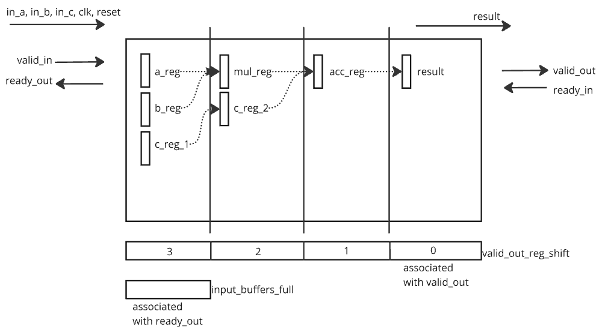
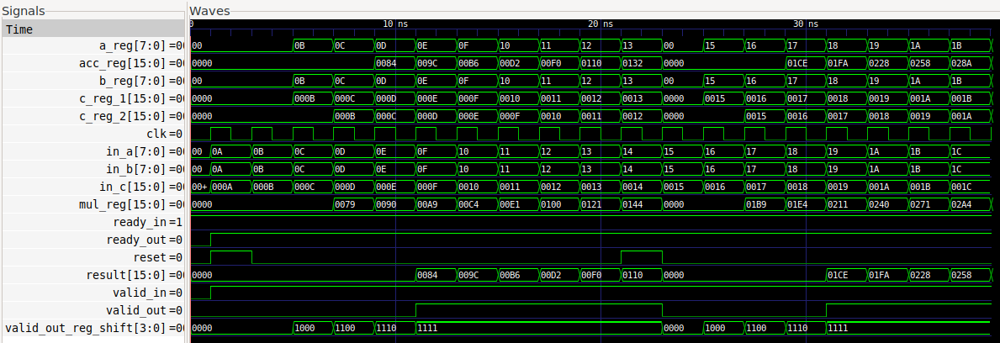

# cocotb_experiment
# Pipelined Multiply and Accumulator

This 4-stage pipelined **Multiply-and-Add** module is designed with **ready-valid handshaking** for reliable data processing.

## Overview
The module performs `result = (in_a * in_b) + in_c` in a pipelined manner over **four stages**:

1. **Register Inputs:** Capture `in_a`, `in_b`, and `in_c`.
2. **Multiplication:** Compute `in_a * in_b`.
3. **Addition:** Add stored `c` value from the previous cycle.
4. **Output Stage:** Provide the final result.

---

## Block Diagram
  

## Results  (log_output.txt)
 

The full behaviour of the pipeline is shown here 

---
## 2 tests are done to verify the functionality
1. Log all the data in the clock edges
2. Compare values expected vs calculated

---
# Used Tools
1. Verilator
2. gtkwave
